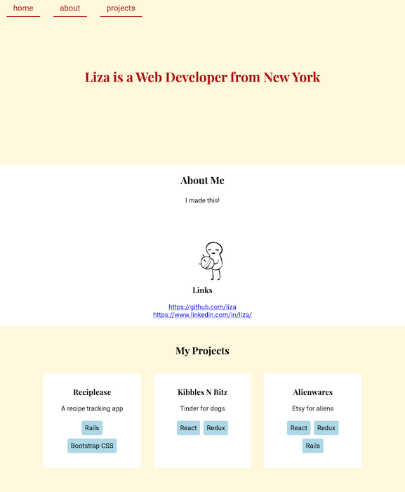

# Lists and Keys Lab

## Learning Goals

- Practice writing dynamic components
- Practice jumping into existing code and making the necessary changes

## Introduction

We'll keep building our portfolio site and add the ability to display a list of
projects based on an array of project data.

Here is an image of what we want once we are finished:



...and here is a tree view of our component parent-child structure:

```text
└── App
    ├── NavBar
    ├── Home
    ├── About
    |   └── Links
    └── ProjectList
        |   ProjectItem
        |   ProjectItem
        └── ProjectItem
```

## Deliverables

It's recommended that you run `npm start` and work on this in the browser
**before** running tests - try to get your app to match the demo! Once you've
built out the components below, run `npm test` or `learn test` to see if your
code passes the tests.

### NavBar

In the `NavBar` component, there is an array with three strings representing
each link on the page. For each of those strings, create an `<a>` tag that looks
like this:

```js
<a href="#home">Home</a>
```

Make sure each `<a>` element also gets a unique `key` prop!

### ProjectList

In the `ProjectList` component, a prop of `projects` is being passed down from
the `App` component with an array of objects. For each object in the array,
render one `ProjectItem` component with the correct props. Use the `id` of the
project for the `key` prop.

### ProjectItem

The `ProjectItem` component should get a prop of `technologies` passed down from
`ProjectList`. For each element in this array of technologies, create a `<span>`
tag that displays the name of the technology.

## Resources

- [Lists and Keys](https://reactjs.org/docs/lists-and-keys.html)
